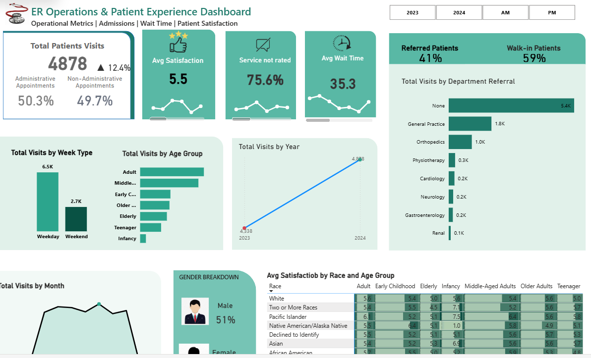

# ER Operations & Patient Experience Dashboard

## Project Overview
This Power BI dashboard analyzes emergency room operational performance and patient experience metrics across multiple years.  

The objective was to design a structured analytical model that provides visibility into visit volume trends, patient satisfaction, referral patterns, and demographic distribution.

---

## Business Questions Addressed
- How has total ER visit volume changed year-over-year?
- What is the average patient wait time?
- What percentage of visits are referrals vs walk-ins?
- Are there satisfaction differences across demographic groups?
- Which patient segments contribute most to visit volume?

---

## Key Metrics
- Total Patient Visits
- Year-over-Year Growth %
- Average Wait Time
- Average Satisfaction Score
- Referral vs Walk-in Distribution
- Gender, Race & Age Breakdown

---

## Technical Implementation
- Built star schema with fact and dimension tables
- Developed DAX measures for KPI tracking and YoY comparison
- Applied time-based calculations for performance analysis
- Implemented slicer-driven interactivity
- Designed dynamic KPI cards with conditional formatting
- Performed data cleaning and transformation using Power Query

---

## Tools Used
- Power BI
- DAX (Measures & Time Comparison)
- Power Query (M)
- Data Modeling

---

## Dashboard Preview

---

## 🎥 Demo Video
Watch the 90-second walkthrough here:  
👉 [Hospital ER Dashboard Walkthrough](https://youtu.be/zTTw7P4ZN4g)
